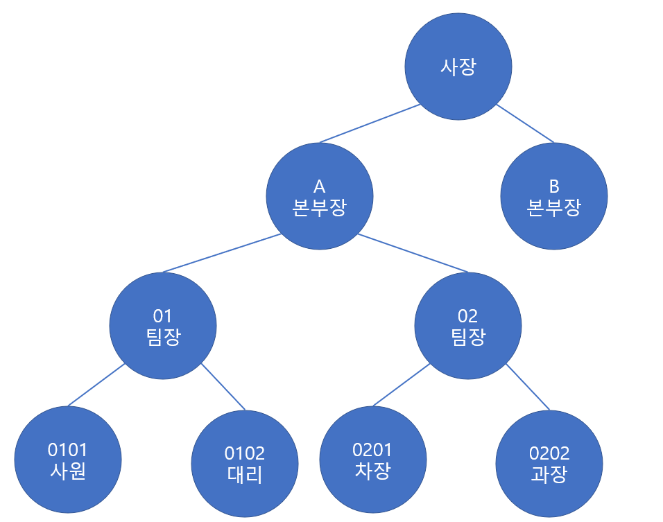
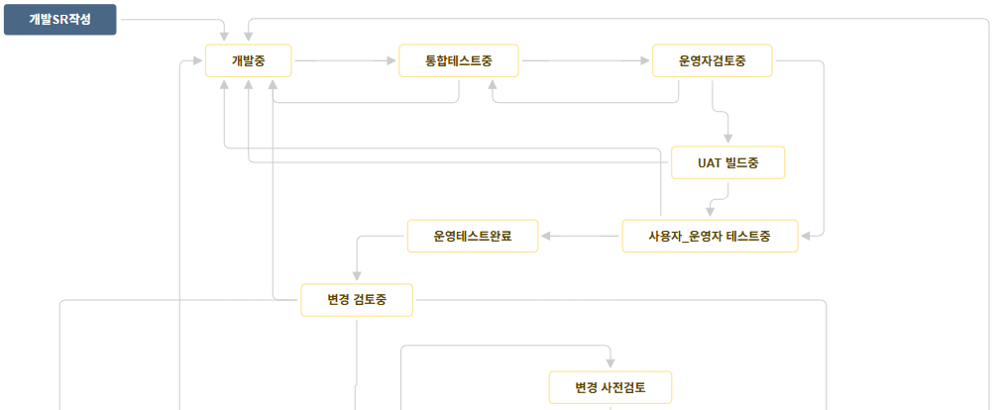
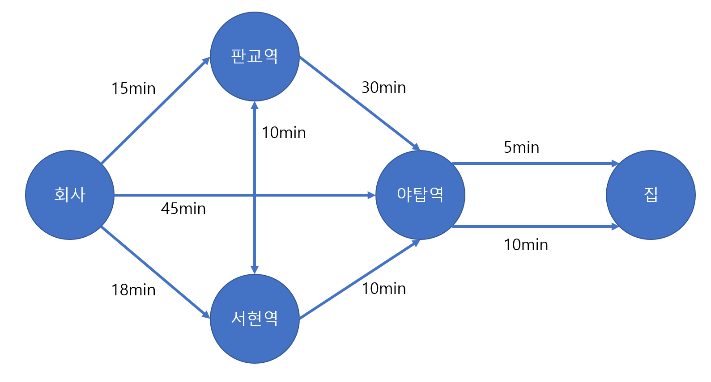

https://github.com/jaehoo1/PS-study/blob/main/study/08_Tree%2C%20Graph.pptx

# Tree
## 개요
계층 구조를 표현할 수 있는 비선형 자료구조 입니다.  
C++ STL이나 Java `Collection` Framework에는 트리 자체를 직접 제공하지 않지만,  
트리를 기반으로 한 자료구조(`TreeMap`, `TreeSet` 등)는 포함되어 있습니다.  
따라서 일반적인 트리 구조(예: 이진트리, 트라이 등)를 사용하려면 직접 구현이 필요합니다.

## 트리 구조의 예시
조직/계급도
```text
회사(사장)
├─A본부(본부장)
│  └─01팀
│      └─01팀장
│          ├─0101사원
│          └─0102대리
│  └─02팀
│      └─02팀장
│          ├─0201차장
│          └─0202과장
├─B본부(본부장)
...
```


폴더 구조
```text
cmd>tree
폴더 PATH의 목록입니다.
D:.
├─docs
├─out
│  └─production
│      └─java-ds-algo-practice
│          └─main
│              ├─editorial
│              └─solve
├─problem
└─src
    └─main
        ├─editorial
        └─solve
```

## 순회(Traversal)
- DFS
  - Preorder Traversal : 루트 → 왼쪽 → 오른쪽
  - Inorder Traversal : 왼쪽 → 루트 → 오른쪽
  - Postorder Traversal : 왼쪽 → 오른쪽 → 루트
- BFS
  - Level Order

<hr/>

# Graph
## 개요
정점(Vertex)과 간선(Edge)들로 구성된 정점들 간의 관계(ex: 경로, 가중치)를 표현하는 비선형 자료구조 입니다.  
간선 구조에 따라 무방향(양방향) 그래프, 비순환(no-cycle) 그래프 등으로 분류할 수 있습니다.

## 그래프 구조의 예시
가중치가 없는 방향(순환) 그래프  


가중치가 있는 방향(순환) 그래프


## 순회(Traversal)
크게 2가지 방식이 존재합니다.
- BFS(Breadth First Search) : 너비 우선 탐색
- DFS(Depth First Search) : 깊이 우선 탐색