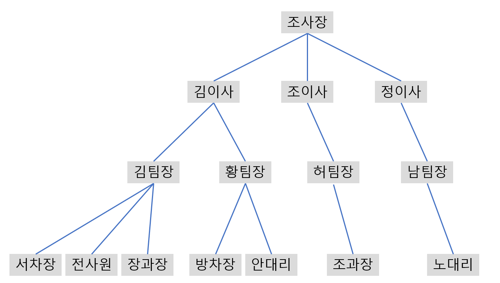

## 문제03
조직의 계급도가 주어질 때 직급 순서대로, 본부/팀원을 같이 출력하는 프로그램을 만들어주세요. 동일한 팀의 팀원일 경우는 순서 상관 없습니다.

- 계급도는 트리 구조임이 보장됩니다. (상사가 다시 부하로 들어갈 수 없음)
- 동명이인은 없다고 가정합니다.

## 입력
첫 줄에는 주어질 상하관계의 수 `N`이 주어집니다.  
다음 `N` 줄에는 `상사-부하` 관계가 주어집니다.  
첫 줄은 트리의 루트(사장)임이 보장됩니다.

## 출력
직급이 높은 순서대로 출력하세요. 상하관계를 눈으로 파악할 수 있게 1depth마다 '--'를 붙여주세요.

## 예제 입력 1
```text
14
조사장-김이사
조사장-조이사
김이사-김팀장
김이사-황팀장
조이사-허팀장
김팀장-서차장
김팀장-전사원
황팀장-방차장
허팀장-조과장
김팀장-장과장
황팀장-안대리
남팀장-노대리
정이사-남팀장
조사장-정이사
```


## 예제 출력 1
```text
조사장
--김이사
----김팀장
------서차장
------전사원
------장과장
----황팀장
------방차장
------안대리
--조이사
----허팀장
------조과장
--정이사
----남팀장
------노대리
```