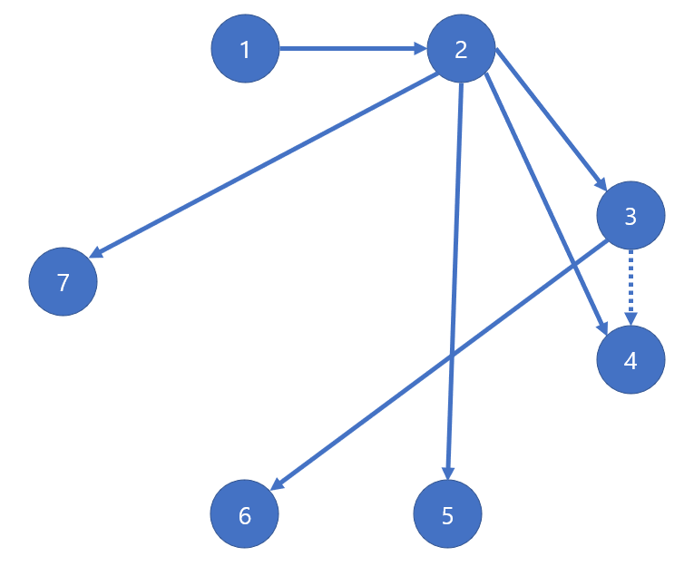

## 문제04
E-commerce의 친구 초대 이벤트를 준비하고 있습니다. 친구를 초대할 때 마다 할인 쿠폰 1장을 발급해 주는 것으로, 신규 회원 가입을 늘리려는 목적이 있습니다.

회원이 초대한 사람들의 관계가 주어질 때, 사람 당 몇 장의 쿠폰을 받게 되는지 계산해 줄 수 있습니까?

## 입력
첫 줄에는 전체 회원의 수 `N`과 친구 초대 관계의 수 `M`이 주어집니다.  
다음 `M` 줄에는 `친구초대한사람 친구초대받은사람` 관계가 주어집니다.  
처음 초대받으면 회원가입을 하게 되지만, 다음에 초대 받을 때는 회원가입이 아닙니다(2번째 초대 시에는 초대한 사람에게 쿠폰이 지급되지 않음)

회원 ID는 1 ~ 10000 의 자연수 임이 보장됩니다.

## 출력
각 회원마다 받게되는 쿠폰의 수

## 예제 입력 1
```text
7 8
1 2
2 3
2 4
2 5
3 4
3 6
2 7
3 4
```


## 예제 출력 1
```text
1 1
2 4
3 1
4 0
5 0
6 0
7 0
```